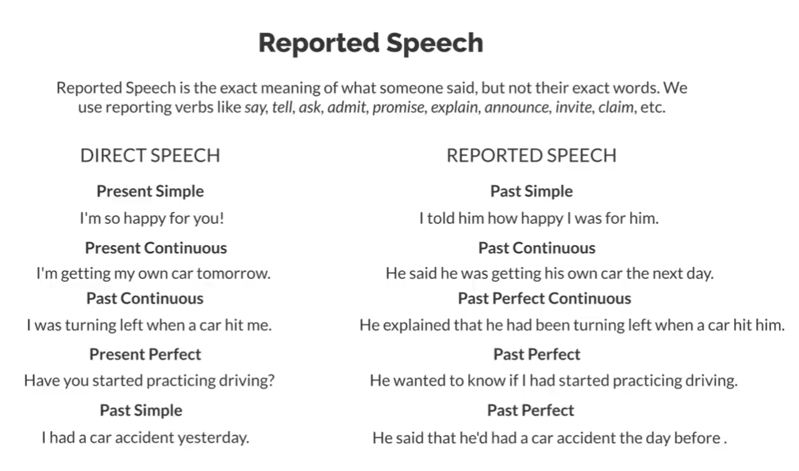
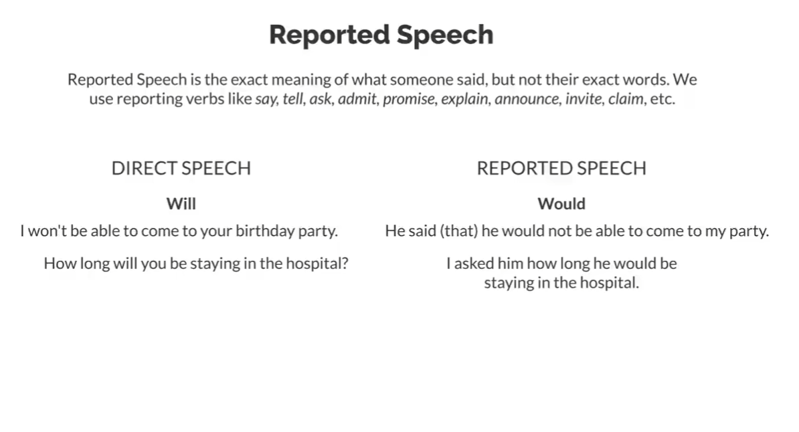
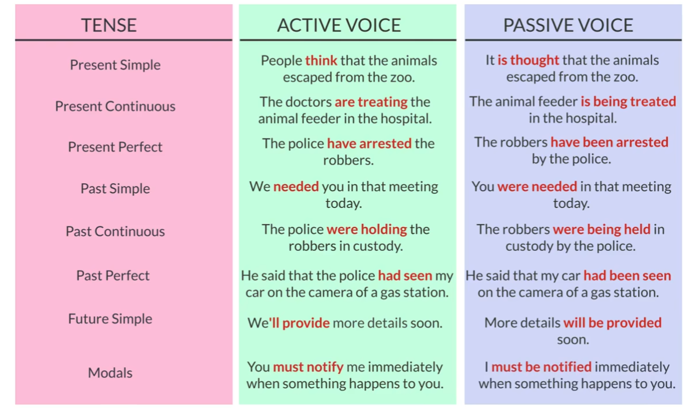
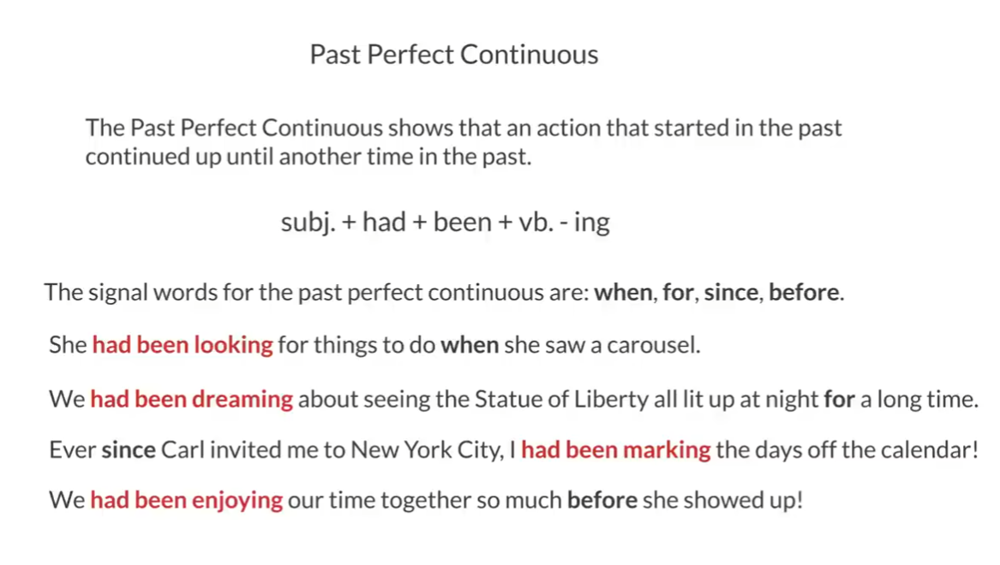
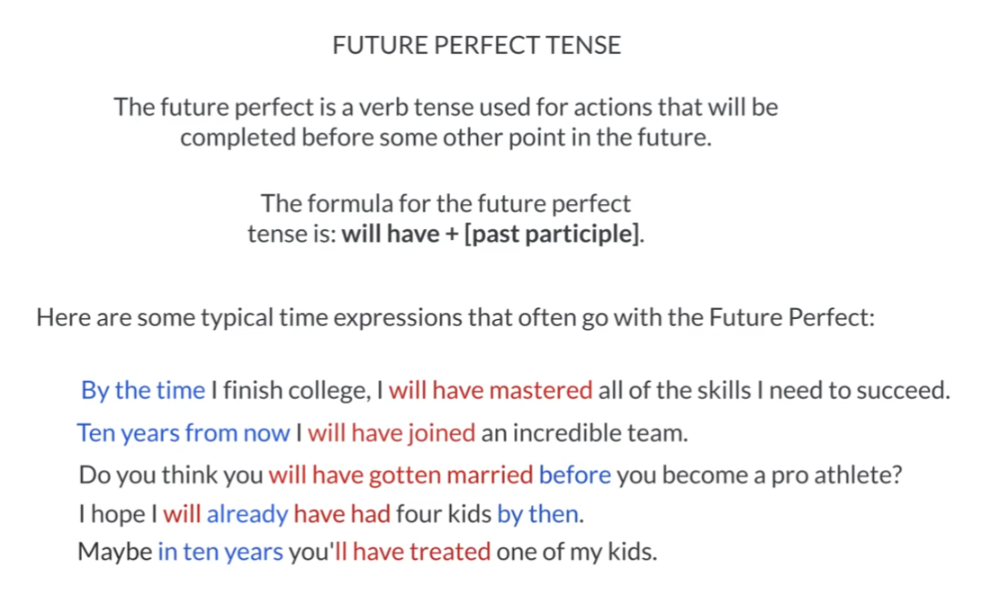

# Vocabulary collocation and authentic expression

the below material and notes are originated from the bili vedio, it's website is [daily conversation](https://www.bilibili.com/video/BV1BV4y1o7jp/?spm_id_from=333.1007.top_right_bar_window_custom_collection.content.click&vd_source=b424988060e823d67d16213edb2c7ff4) .

## Tutorial 001 Are you a Night Owl or an Early Bird?

> It is across from the library and right next door to the restaurant.  

In this sentence, ***across from*** indicates face to face.

***A is right/left next door to B*** means A and B are very close to each other, it usually indicates that A and B are next to each other, and the right/left side of A is B.

> Would you like to come by and check out the apartment?  

* come by = make a visit  

* check out = visit a place in order to learn about it or make an inspection of it

> I've prepared a few questions to see if you'd be a good match as a roommate

* a good match = Someone tho is well suited to someone else. It can  also describe two things fit each other.

> Are you ready?
> go for it!

* go for it = go ahead

> First of all, are you a smoker?

* first of all = in the first place = to begin with. They are exactly the same in sentence.

> I'm really glad you don't either.

1. ***either*** 表示“也”的意思， ***neither*** 表示“也不”的意思

    * ***either*** = as well; also; too
    * “not either"或"neither…nor”：用于否定句子中，表示两个选择都不是。
    * I have never been to russia.
    * I haven't been there either./ Neither have I.

2. ***either or*** 两个选择任选一个，用于肯定句
    * I can meet you either on Monday or Tuesday.

3. ***neither nor*** 两个选择都不，用于否定句
    * Neither John nor Mary can come to the party.

> Are you a noght owl or an early bird?

* ***night owl*** a person who perfers to be active at night.

* ***early brid*** a person who gets up early.

> I tend to get up early because I like to get to the gym early and work out most days.

* ***work out*** = exercise

> I have always liked staying active and fit.

* ***fit*** = healthy and strong

> I'm pretty laid back

* ***laid back***
  * having a relaxed style or character

> but he is really friendly and easy to get along with.

* ***easy to get along with*** = easy-going; approachable

> I do host a few parties a year; but otherwise, I too just have a few friends over every once in a while.

* ***otherwise*** = apart from that; in addition; futhermore; more over; besides; additionally

* ***every once in a while*** = sometimes, but not often
  * 可以直接简化为 ***once in a while***

> what tasks do you prefer to take on?

* take on
  1. 承担
      * She took on the responsibility of organizing the event.
  2. 接受
      * He is always ready to take on new challenges.
  3. 表现出
      * She takes on a very serious tone when discussing important matters.
  4. 呈现或具有（外观、特点等）
      * The old building has taken on a new look after the renovation.

> I will gladly to help out to make sure we keep the apartment clean.

* ***help out*** 表示帮助
  * ***help out with*** 帮助某人进行某项任务或活动。
    * She helps out with the children’s soccer team every weekend.
  * ***help out in*** 在某个特定领域或地方提供帮助。
    * He often helps out in the community garden.
  * ***help out by*** 强调通过特定方式或手段来提供帮助
    * I helped out by donating money to the charity.

> I major in busienss.

* ***major in*** = specialize in

> In general, what are somethings you like to do?

* ***In general*** = By and large; Overall; 总的来说

> I would rather vacation at a beach than at a ski resort.

* ***vacation*** 直接做动词

> I'm fine with parking on the street. My car isn't very fancy. It doesn't need to be in the garbage.

* ***be fine with*** = Be alright with； 表示对某事物或某种情况感到满意、接受或没有异议
  
* ***fancy*** of very high quality

> Great! Well. I think we would make a good fit as roommates.

* ***make a good fit*** = be suitable for each other

> You could move in on Monday, if that works for you.

* ***if that works for you*** = if that acceptable for you

> Rent would be $400 each month

* ***each month*** = per month

---
常用家务：

    * do the dishes 洗碗
    * run the vacuum 真空扫地机
    * clean up the kitchen 打扫厨房
    * mop the floor 拖地
    * clean the bathroom 打扫洗手间
    * dust around the apartment 打扫公寓灰尘

## Tutorial 002 Daily Routines and Household Chores

* ***turn on/off*** 打开/关闭，适用于一切电器
  * turn off the alarm 关掉闹钟
  * turn on the air-conditioning 打开空调

* ***wake up*** 醒来

* ***get up*** 起床

* ***Go to the bathroom to freshen up*** 去洗手间梳洗一下

* ***wash/dry your face/hands*** 洗/擦干，脸/手，

* ***shave*** 刮胡子
  * I need to shave. 我需要刮胡子
  * He shaved his beard off.他剃掉了胡子

* ***brush teeth*** 刷牙

* ***put on cream*** 擦护肤品

* ***take a shower*** 洗澡，淋浴

* ***comb your hair*** 梳头

* ***make bed*** 整理床铺

* ***make/have breakfast/lunch/dinner*** 做/吃早饭/午饭/晚饭

* ***put on make-up/perfume*** 化妆/喷香水

* ***go/get home*** 往家走/到家

* ***take a nap** 小睡一会

* ***take out the garbage/trash*** 把垃圾拿出去

* ***throw the garbage/trash*** 丢垃圾

* ***sweep the floor*** 扫地

* ***do/wash the dishes*** 洗碗

* ***meet up with friends*** 会朋友

* ***mop the floor*** 拖地

* ***clean the window/toilet*** 擦窗户/马桶

* ***water the plants*** 浇花

* ***do the dusting*** | ***dust around the room*** 打扫灰尘

* ***hang out the clothes to dru*** 晾晒衣服

* ***tidy up the room*** 整理房间

* ***run the vacuum*** | ***vacuum*** 吸尘器扫地

* ***phone/text friends*** 给朋友带打电话/发消息

* ***walk the dog*** 遛狗

* ***iron the clothes*** 熨烫衣服

* ***go for a walk*** 散步

* ***take pictures*** 拍照

* ***take a bath*** 泡澡

* ***clip your nails*** 剪指甲

* ***set the alarm*** 订闹钟

* ***fall asleep*** 睡觉

## Tutorial 003 Don't Forget to Live Your Life

* ***aspire*** 追求、渴望达到某个目标
  * aspire to do
  * I aspire to be a CEO.

* ***stay in touch with sb*** 与某人保持联系

1. 在某些动词后面接动名词（gerund）或不定式（infinitive）时，会改变词义或表达的含义

    * ***stop***
        * You should stop to enjoy life, too.
            * interrupt an action to do something else
        * Stop worrying about me.
            * the action should not continue any longer.

    * ***forget***
        * You forget to leave time for yourself.
            * you fail to
        * I will never forget making a fool of myself when I cooked dinner for some friends.
            * forget the memory

    * ***remember***
        * Remember to relax, have fun and live life along the way.
            * don't forget to
        * I remember sleeping in and waking up to a home cooked breakfast.
            * I have memories of

    * ***regret***
        * I regret to say that sacrificing your personal life is a pretty big price to pay.
            * I'm sorry to say this
        * I don't want to regret wasting my life on unimportant things.
            * regret that I wasted my life

    * ***mean***
        * I've been meaning to pay you a visit.
            * mean to = intend to, 强调动作本身
        * That would mean saying goodbye to any chance of promotion.
            * what the result of an action will be， 强调动作带来的结果

    * ***try***
        * Try to slow your life down and even find a hobby.
            * attempt to, 强调行动本身
        * You can try volunteering at the soup kitchen, too.
            * experiment，强调通过体验或实践来了解某种行为或情况的结果

2. 在某些动词后面接动名词（gerund）或不定式（infinitive）时，**不会**或者几乎不会改变词义或表达的含义

    to do 与 doing 相同，例如：

    > I hate to cook | I hate cooking

    * ***hate***
    * ***prefer***
    * ***like***
    * ***start***
    * ***continue***
    * ***love***

3. 部分动词后接动名词

  > “Common verbs followed by a gerund” 指的是经常与动名词（gerund）连用的常见动词。动名词是动词的一种形式，以-ing结尾，可以作为名词使用。这些常见的动词后面跟着动名词形式，形成动词短语。
  > 举例来说，如果一个动词是"enjoy"，它常常后接动名词形式，如：“enjoy swimming”（喜欢游泳），“enjoy reading”（喜欢阅读）等。这些常见的动词和动名词的组合在英语中非常常见，表达各种动作、喜好、兴趣、经验等。

    * ***suggest***
    * ***look forward to***
    * ***imagine***
    * ***enjoy***
    * ***keep***
    * ***dislike***
    * ***risk***
    * ***miss***
    * ***avoid***
    * ***postpone***
    * ***give up***

4. 部分动词后接不定式

        不定式是一个动词形式，通常由"to"加上动词原形构成。例如：“to go”、“to eat”、"to study"等。不定式可以用作名词、形容词或副词，并且在句子中可以充当不同的语法角色。

        以下是一些常见的用法：

        作为名词：不定式可以作为名词的主语、宾语、表语等。

        To travel is my dream.（旅行是我的梦想。）
        He wants to eat pizza.（他想吃披萨。）
        作为形容词：不定式可以修饰名词，表示目的、目标、愿望等。

        I have a book to read.（我有一本书要读。）
        She needs a pen to write with.（她需要一支可以写字的笔。）
        作为副词：不定式可以修饰动词、形容词或副词，表示目的、结果等。

        He worked hard to succeed.（他为了成功而努力工作。）
        The music was too loud to hear anything.（音乐太吵了，什么都听不见。）
        不定式可以有时态和语态的变化，如动态不定式（如：“to be going”）、被动不定式（如：“to be eaten”）。它也可以根据句子的需要进行完成时态、进行时态、被动语态等变换。

    * ***decide to***
    * ***aspire to***
    * ***want to***
    * ***need to***
    * ***get to***
    * ***plan to***
    * ***struggle to***
    * ***can't afford to***
    * ***manage to***
    * ***strive to***
    * ***promise to***
    * ***protect to***

## Turorial 004 Making Complaints

> Will that be all?

* 就这些吗？

> It's for here or to go, sir?

* 在这吃还是带走

* 在这吃的表达：***For here, please***;
* 带走的表达：***To go, Please***;***For takeaway, please***;

> Sure. If you could just bear with me for a moment, I will get you the correct order.

* ***bear with me*** = be patient with
  * If you are patient with me

> Your order got mixed up with someone else's.

* ***mix up*** = confuse
  * I ***confuse/mix up*** yours with others'

* ***(mix up)/confuse with*** 和其他的搞混

> I gave you some free French fries to make up for it.

* ***make up for***
  * compensate for something bad with sonething good

> I hope they do the trick.

* ***do the trick***
  * achieve the desired result

> I try to sleep in on weekends

* sleep until later in the morning than you usually do

> I can't speak for our neighbors, but it's perfectly fine during the weekends.

* ***speak for***
  * represent the feelings or opinions of another person

> Don't get me wrong, but weekengd are the only chance I have to catch up on sleep.

* ***get me wrong***
  * don't misunderstand me

* ***catch up on***
  * do something that you have not been able to do recently
  * 补充，追赶，强调了通过努力而迅速弥补之前的落后，追回进度或与最新情况保持同步。它常用于描述对于延迟的事情进行赶进度或迎头赶上的情况。

> It's all good, you don't need to explain yourself.

* ***It's all good*** = Don't worry

> We're working on this and awe promise to have this issue solved in almost no time.

* ***in almost no time*** = very quickly

---

## Tutorial 005 Renting an apartment

* ***cshedule a viewing***
  * arrange a time to view a property

## Tutorial 006 Reported speech

> It will help me with my independence big time.

* ***big time*** = in a major way
  * 表示重要，口语化表达
  * The meeting is big time.
  * We need to prepare for the meeting big time

> Driving will give you a good start in life, and it opens a lot more doors.

* ***Open a lot more doors***
  * 某事情可以给人更多的机会或可能性。它表示某个行动或决策可以创造更多的机遇，打开更多的门。
  * Learning a foreign language can open a lot more doors for job opportunities.

> Do you know who I bumped into yesterday?

* ***bump into*** = meet by chance
  * I bumped into an old friend at the grocery store yesterday.昨天我在杂货店无意中遇到了一位老朋友。
  
> He offered to help me with the party.

* ***offer to do***表达了主动提供或愿意做某事的意思。这个表达通常用于表示你主动提出或积极主动提供帮助、做某项任务或履行某种责任。
* I offered to do the dishes after dinner.我主动表示愿意洗碗。

> Before we parted, I wished him the best of luck and safe driving in his new car.

* ***part*** = say goodbye and depart

> This is nothing short of a miracle.

* ***nothing short of a miracle*** = almost a miracle

> Even when he faces hardships. he always looks on the bright side of things.

* ***looks on the bright side of things*** = find good things in a bad situation

---

## Tutorial 007 Tell ME About Yourself

> Make sense. What do you know about our company so far?

* ***Mkae sense*** = I see; I get it;
  * make sense 指的是听起来很有道理，很合理。
  * I get it 表示我明白了

* ***so far*** 意思是到目前为止或迄今为止
  * I’ve finished three chapters of the book so far. 到目前为止，我已经完成了这本书的三章。

> But I soon realized I wasn't cut out for that job.

* ***be cut out for/to*** 意思是某人具备或适合从事某种活动、职业或角色
  * She’s really cut out for a career in marketing. 她真的很适合从事市场营销工作。
  * I don’t think he’s cut out to be a chef. 我认为他不适合当厨师。

> What are your strengths?

* ***strength*** = good characteristics

> But I'm working on this, and try to stop myself from being overly direct.

* ***overly*** = too

> where do you see yourself in five years?

* 这句话可以翻译为 “五年后你对自己有什么规划？”
* 常见的面试问题，用于了解求职者对自己未来的职业规划和目标的展望。

---

## Tutorial 008 The Passive Voice

> I'm really sorry, but I was stuck in traffic.

* ***stuck*** stick的过去式和过去分词

> rush-hour traffic

* 交通高峰时间
* Try to avoid rush-hour traffic. 尽量避开交通高峰时间。

> I'll give you the benefit of the doubt for now.

* ***give you the benefit of the doubt*** 虽然我不确定事实是怎么样的，但是我暂时相信你。

> When I was pulled over, the policeman asked me to get out of the car.

* ***pull over*** 靠边停车

主被动语法总结：

---

## Tutorial 009 We'd Been Hoping for a Romantic Trip

---

## Tutorial 010 Years from Now. The Future Perfect Tense

> By the time I finish college, I will have mastered all of the skills I need to succeed.

* ***by the time*** 意味着某个特定点或事件之前或之时。它指的是在某个特定时间点之前发生或完成某个动作或情况。

* “Please finish your homework by the time I come home.” 请在我回家之前完成你的家庭作业。

* > Do you think you will have gotten married before you become a pro athlete? 

* by the time 替换 before

> ***ten years from now*** 十年之后

* 等于in ten years’ time

* in the coming years: 在接下来的几年里

> I think I will have moved someplace warmer by then

* ***by then*** 到那时候，与未来完成时一起使用，表示在某个具体时间点之前已经完成的动作或情况

* “I will have finished my project by then.”（到那时候我将已经完成我的项目。）

## Tutorial 011 A-One-way Ticket, Please

> I am  the same way

* 这句话可以理解为"我也是这样"或"我有同样的感受/想法”。这个表达方式用来表示自己和对话中的另一方有着相似的态度、感受或行为。等价于me too

* A: “I always get nervous before giving a presentation.”（我在做报告之前总是感到紧张。）
B: “I am the same way. Public speaking makes me anxious too.”（我也是这样。公众演讲让我感到焦虑。）

> Would you like a one-way ticket or a round-trip ticket?

* ***one-way ticket*** 单程票
***round-trip ticket*** 往返票

> Go past the bookstore and turn right.

* ***go past somewhere*** 经过某处

## Tutorial 012 At the Airport

## Tutorial 013 Cooking Verbs

